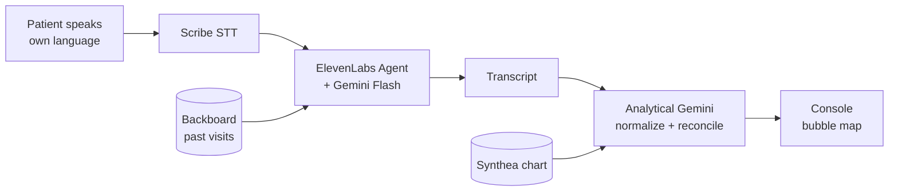

# HopHacks F26 — Team Handoff

**Sep 19, 2026 · @Ahmad**

## What we're building

A free, multilingual voice intake kiosk for a pro bono clinic.

A patient sits with a tablet in the waiting room and talks, in their own language, about what they take. Not a form — a conversation that asks follow-up questions when someone cannot name their medication. We reconcile what they said against their existing chart and hand the volunteer clinician one screen.

That screen is a bubble map with exactly three kinds of flag.

| Flag | Means | Comes from |
| --- | --- | --- |
| Disclosed | Already in the chart | Chart |
| Undisclosed | Patient said it, chart does not have it | Intake transcript |
| Ask | In neither — a question worth putting to them | Interaction reasoning |

Colour is the flag kind, size is severity, edges are known drug interactions. Every Undisclosed flag shows the patient's own words beside the clinical term.

The whole value sits in that middle row: the things people never tell their doctor, surfaced because something finally asked them in a language they actually speak.

## Why this matters — Marie-Ange

Marie-Ange is 61. She came from Port-au-Prince eleven years ago and she cleans offices downtown at night. She has no insurance, so she goes to the free clinic on Saturdays, where a volunteer doctor gives her nine minutes.

Her daughter usually translates. Today her daughter is at work, so the nurse uses a phone line, and Marie-Ange answers the questions she understands and nods at the ones she does not.

Nobody asks about the tea.

It is not medicine, so she would not have thought to mention it anyway. Her sister sends the leaves from home and she has drunk it every morning for thirty years, for her nerves. It is the only thing left in her kitchen from a house that no longer exists.

She is also on warfarin. The tea is why her bloodwork keeps coming back strange, and why her doctor — who is doing everything right, for free, on a Saturday — keeps adjusting a dose that was never the problem.

The gap is not the doctor. It is nine minutes, a phone line, and a word Marie-Ange does not have in English.

Our product is the ten minutes before those nine minutes. She sits with a tablet and it speaks Haitian Creole. It asks what she takes, and when she says the tea my sister sends, it does not give up — it asks what is in it, what it is for, how long. By the time she walks in, the doctor already knows.

That is the demo. It opens on Marie-Ange, not on a dashboard.

## How we work

Three people, three streams, no spare integrator. About 34h of build against roughly 66 person-hours.

| Stream | Owns |
| --- | --- |
| A | Synthea seed, closed vocabulary, analytical Gemini, reconciliation, Ask List |
| B | ElevenLabs Agent, conversational Gemini, Backboard |
| C | Console, bubble map, provenance pair |
| Shared | Deploy, domain, 8 submissions, rehearsal |

**Hour 0–2 — freeze the contracts.** Agree three JSON shapes before anyone writes logic: chart record, intake transcript, flag object. This is the only thing making the streams converge. Skip it and Sunday morning goes to reconciling field names instead of rehearsing.

**Hour 0–1 — two things in parallel with that.** Redeem the capped perks (Cursor Pro, 400 seats; Grok credits, 250; ElevenLabs Creator via Discord), and test Haitian Creole transcription quality in Scribe. If it is poor, fall back to Mandarin or Arabic now, not at hour 30.

**Riskiest item is the ElevenLabs agent, at ~8h.** If it slips, everything downstream idles. Stream B starts first and asks for help early.

**Reserve the last 3h.** Rehearsal plus eight Devpost writeups. Teams routinely qualify for prizes they never submit to, and our whole strategy is prize count.

## Our track: Bloomberg, Most Philanthropic Hack

We get exactly one track. We are spending it on Bloomberg — best application promoting philanthropic goals. Prize is Beats headphones for 1st.

**Why not the Forge healthcare track.** Its $2,000 is contingent on joining the Forge cohort. That is not prize money with a formality attached, it is consideration for tying ourselves to a Johns Hopkins-affiliated venture programme. We decline on those terms, and we would decline even if Forge were the easiest track at the event. Separately, healthcare is the most saturated pool at HopHacks — roughly half of all winning projects for three years running, and the same archetypes every time.

**What carries our philanthropic claim.** A free application that removes a language barrier to competent medication history-taking, for uninsured and limited-English-proficiency patients. That is philanthropic by outcome. We have no giving mechanism — no donations, no volunteer roster, no scheduling. We cut all of it deliberately as scope.

**The risk, stated plainly.** The one confirmed past winner of this track, RippleEffect in 2025, was a micro-donations product — philanthropic by mechanism. Outcome is a weaker read of the rubric. We accepted that knowingly, which means the burden moved off the build and onto the pitch.

So the pitch is the deliverable. Four rules, none of them negotiable:

1. **Open on Marie-Ange, never on the console.** A demo that starts at a clinician dashboard gets filed as a productivity tool and scored against donation platforms, where we lose.
2. **Run the intake live, in a non-English language.** This is the emotional beat and it is also our ElevenLabs submission.
3. **Cut to what the clinician now sees.** The interaction UI is evidence that access produced better care — not the headline.
4. **Say free out loud.** No tiers, no pricing slide, no "for hospitals". An outcome-based philanthropic claim dies the moment the product looks sellable.

## The other seven submissions

Branded prizes have no exclusivity — one project, as many as we qualify for. Eight submissions total, each needing its own Devpost writeup. Overall 1st/2nd/3rd ($1024/$512/$256) are automatic and need nothing.

| Submission | What it needs from the build | Prize |
| --- | --- | --- |
| ElevenLabs (standalone) | Agent with real agentic depth: multilingual intake, follow-ups when a drug cannot be named | 6 months Scale tier per member, $1,794 value |
| ElevenLabs / MLH | Same integration, separate entry | Wireless earbuds |
| Google Gemini / MLH | The analytical role — normalization, reconciliation, Ask List | Google swag kit |
| Backboard / MLH | Conversational memory across visits, the returning-patient beat | Tile Essentials per member |
| DigitalOcean / MLH | Deploy there. $200 credits free to all of us | Retro wireless mouse |
| GoDaddy Registry / MLH | Register a domain. Ten minutes | Digital gift card |
| Auctor AI | "From Conversation to Action" — the intake conversation produces the Ask List | Merch, 1st–3rd |

Our highest-value prize is ElevenLabs, and it counts twice. Their rubric names agentic depth first. Using ElevenLabs as a dumb microphone and speaker forfeits it — the agent has to actually converse, ask follow-ups, and handle a patient who says "the tea my sister sends".

**Two thin submissions to strengthen.** Gemini needs the analytical story, not "it is the LLM inside our voice agent", which is a thin claim. Backboard needs the returning-patient moment visible on screen.

**Stack is frozen at seven.** Tiger Data, Snowflake and Solana are all reachable and all declined on scope. Solana would have been coherent with a donation mechanism; we do not have one. Do not reopen this at hour 20.

**Out of reach entirely:** OPEF and SpaceXAI, which need an environmental or space spine. Forfeited when we chose healthcare.

## Rules we do not break

Three decisions that will look like obstacles around hour 20. They are in `docs/adr/` in the repo with full reasoning. Each one is load-bearing.

1. **Undisclosed means discrepancy, never inference.** If a drug is not in the chart, no amount of reasoning over the chart establishes that the patient takes it. Two sources only: Undisclosed came from the transcript, Ask is phrased as a question. "Ask whether they take St. John's Wort, it interacts with their SSRI" is safe. "Patient takes St. John's Wort" is a fabricated clinical claim about a named person, in front of Hopkins clinicians. Ask List items render interrogative — that is a UI invariant, not a prompt suggestion.

2. **No Dubbing.** ElevenLabs speech-to-speech translation looks like a shortcut: translate the patient to English, run everything downstream in English. It destroys the original-language utterance, so the provenance pair cannot be formed and our record becomes a translation of a translation. Scribe transcribes in-language; Gemini normalizes from there.

3. **One clinical source of truth.** Synthea chart DB holds clinical facts. Backboard holds conversational memory only. A memory layer will faithfully remember a hallucinated drug name forever and cannot catch one. Two stores of patient facts makes "where did this flag come from?" unanswerable on stage, which is the question we most need to answer cleanly.

**Grounding, while we are here.** Gemini picks from a closed vocabulary of ~200 common meds, OTC drugs and supplements via structured output, or returns unrecognised. The unrecognised path is a gift — it sends the agent back to ask a follow-up, which is exactly the agentic depth ElevenLabs rewards. RxNorm is the upgrade if stream A finishes early.

## Still open

- [ ] We have no name. Blocking the GoDaddy submission, which is otherwise ten free minutes. Pick one in the first hour.
- [ ] Second language. Spanish is non-negotiable for a Baltimore clinic. Haitian Creole is the stronger second choice — a low-resource language makes the equity argument far more sharply than Mandarin, because it is exactly the population big systems do not serve. Verify Scribe handles it before stream B commits.
- [ ] Read the ElevenLabs hacker guide. Linked in the sponsor doc, sign-in gated. Likely carries prize-specific requirements we have not seen.
- [ ] Repo scaffold with the three frozen contracts, so A, B and C can start in parallel.
